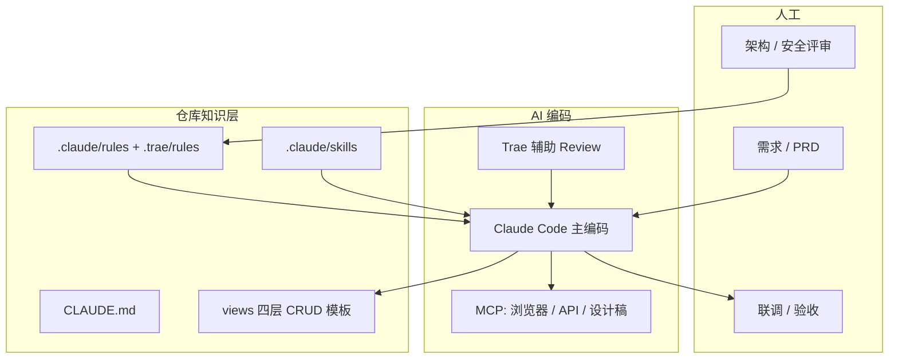

# AI 前端开发落地指南（vue-vben-admin + Claude Code）

> 基于当前仓库 **vue-vben-admin 5.7**（pnpm monorepo、`apps/web-antd` 为主应用）制定。  
> 目标：人工聚焦需求澄清、架构决策、联调验收与安全审查。  
> 主工具：**Claude Code**；辅助：**Trae**（Review、并行探索、浏览器验证）。

---

## 目录

1. [总体架构与分工](#1-总体架构与分工)
2. [仓库现状与 AI 可复用模式](#2-仓库现状与-ai-可复用模式)
3. [工具链：Claude Code 为主、Trae 为辅](#3-工具链claude-code-为主trae-为辅)
4. [目录结构（建议一次性初始化）](#4-目录结构建议一次性初始化)
5. [插件 / MCP 清单](#5-插件--mcp-清单)
6. [Rules 完整清单（Claude + Trae 双轨）](#6-rules-完整清单claude--trae-双轨)
7. [Skills 完整清单（含可直接复制的 SKILL.md）](#7-skills-完整清单含可直接复制的-skillmd)
8. [CLAUDE.md 推荐全文](#8-claudemd-推荐全文)
9. [settings.json 与权限模板](#9-settingsjson-与权限模板)
10. [AI 编码工作流（按任务类型）](#10-ai-编码工作流按任务类型)
11. [Prompt 模板库](#11-prompt-模板库)
12. [质量门禁与人工必审点](#12-质量门禁与人工必审点)
13. [AI 功能模块落地建议（业务向）](#13-ai-功能模块落地建议业务向)
14. [团队 onboarding 检查表](#14-团队-onboarding-检查表)
15. [附录：与官方文档对照](#15-附录与官方文档对照)

---

## 1. 总体架构与分工



| 角色 | 职责 | 工具 |
| --- | --- | --- |
| 产品 / 业务 | 页面清单、字段、权限点 | 飞书 / Markdown PRD |
| 前端 | 拆任务、写 Prompt、过 CR、关键逻辑 | Claude Code + Trae |
| AI | CRUD、路由、国际化键、Mock、样式微调 | Claude Code |
| 测试 | E2E 场景、回归 | Playwright + Trae 浏览器 MCP |

**原则**

- **事实进 CLAUDE.md**（构建命令、目录约定、禁止事项）
- **流程进 Skills**（新建 CRUD 页、接 AI 接口、发 PR）
- **文件类型进 Rules**（`*.vue`、`api.ts`、路由各自约束）
- **长参考不进每次会话**：用 path-scoped rules + skills 按需加载

---

## 2. 仓库现状与 AI 可复用模式

### 2.1 技术栈

| 项     | 当前项目                                               |
| ------ | ------------------------------------------------------ |
| 框架   | Vue 3 + Composition API + `<script setup>`             |
| UI     | **Ant Design Vue**（`apps/web-antd`，非 Element Plus） |
| 表格   | VxeTable（`#/adapter/vxe-table` → `useVbenVxeGrid`）   |
| 表单   | Vben Form（`#/adapter/form` → `VbenFormSchema`）       |
| 弹层   | `useVbenDrawer` / `useVbenModal`（`@vben/common-ui`）  |
| 请求   | `requestClient`（`#/api/request`）                     |
| 状态   | Pinia（`#/store`）                                     |
| 路由   | `apps/web-antd/src/router/routes/modules/*.ts`         |
| 规范   | `@vben/eslint-config`（根目录 `eslint.config.mjs`）    |
| 包管理 | pnpm workspace + turbo                                 |
| Node   | `^22.18.0 \|\| ^24.0.0`                                |

### 2.2 业务页标准四层结构（**AI 复制此模式**）

以 `apps/web-antd/src/views/system/user/` 为金标准：

```
views/<module>/<feature>/
├── api.ts          # 类型命名空间 + requestClient CRUD
├── config.ts       # useFormSchema / useGridFormSchema / useColumns
├── index.vue       # 列表页：Grid + Drawer/Modal + 业务逻辑
└── modules/
    └── form.vue    # 表单抽屉/弹窗
```

**禁止** AI 再创建已废弃的：

- `src/api/system/*.ts` 集中式 API（已迁到 views 下 `api.ts`）
- `list.vue` + `data.ts` 老命名（现为 `index.vue` + `config.ts`）

### 2.3 常用命令（写入 CLAUDE.md）

```bash
pnpm install
pnpm dev:antd              # 主应用 http://localhost:5173（以实际端口为准）
pnpm -F @vben/web-antd run typecheck
pnpm lint
pnpm run build:antd
pnpm test:unit
```

### 2.4 路径别名

- 应用内：`#/xxx` → `apps/web-antd/src/xxx`
- 包：`@vben/xxx` workspace 包

---

## 3. 工具链：Claude Code 为主、Trae 为辅

| 场景 | 推荐工具 | 说明 |
| --- | --- | --- |
| 新页面 / 大段生成 | **Claude Code** CLI | `claude` 在项目根或 `apps/web-antd` 启动 |
| 初始化项目记忆 | Claude `/init` | 生成 `CLAUDE.md`、skills、hooks 提案 |
| 按文件精细改 | Claude Code | path-scoped rules 自动生效 |
| CR / 并行搜代码 | Trae Agent | 只读 explore、代码检索 |
| 浏览器点验 | Trae 内置浏览器 / MCP | 登录、表格、弹窗流程 |
| 设计稿 → 代码 | Figma MCP（可选） | 有稿时用 `figma-use` skill |
| 提交 / PR | Claude skill `/commit-pr` 或人工 | 敏感操作人工确认 |

**Claude Code 官方能力对照**

| 能力 | 路径 | 文档 |
| --- | --- | --- |
| 项目记忆 | `CLAUDE.md` / `.claude/CLAUDE.md` | [memory](https://code.claude.com/docs/en/memory) |
| 分路径规则 | `.claude/rules/*.md` | 同上 |
| 技能 | `.claude/skills/<name>/SKILL.md` | [skills](https://code.claude.com/docs/en/skills) |
| 团队配置 | `.claude/settings.json` | [settings](https://code.claude.com/docs/en/settings) |
| MCP | `.mcp.json` | [mcp](https://code.claude.com/docs/en/mcp) |
| 子代理 | `.claude/agents/` | [sub-agents](https://code.claude.com/docs/en/sub-agents) |
| Hooks | `.claude/settings.json` → hooks | 提交前 lint 等 |

**Trae 双轨（可选，团队已用 Trae 时）**

| 能力 | 路径                                         |
| ---- | -------------------------------------------- |
| 规则 | `.trae/rules/*.md` 或 Trae 项目 Rules 配置   |
| 技能 | `.trae/skills/<name>/SKILL.md`（若版本支持） |
| MCP  | Trae 设置 → MCP                              |

建议：**Claude 的 `.claude/rules` 为权威**；Trae 规则用 `symlink` 或复制保持同步。

---

## 4. 目录结构（建议一次性初始化）

在仓库根目录执行（或由负责人提交到 git）：

```text
vue-vben-admin/
├── CLAUDE.md                          # 项目总记忆（提交）
├── CLAUDE.local.md                    # 个人覆盖（gitignore）
├── .mcp.json                          # 团队 MCP（提交）
├── .claude/
│   ├── CLAUDE.md                      # 可与根 CLAUDE.md 二选一或 @import
│   ├── settings.json                  # 权限、hooks、插件（提交）
│   ├── settings.local.json            # 个人 API Key 等（gitignore）
│   ├── rules/
│   │   ├── global.md                  # 全局约定
│   │   ├── vue-pages.md               # paths: views/**/*.vue
│   │   ├── api-layer.md               # paths: **/api.ts
│   │   ├── router.md                  # paths: router/**/*
│   │   ├── ant-design-vue.md          # UI 组件约定
│   │   └── ai-features.md             # AI 业务模块约定
│   ├── skills/
│   │   ├── vben-crud-page/SKILL.md
│   │   ├── vben-route-menu/SKILL.md
│   │   ├── vben-mock-api/SKILL.md
│   │   ├── ai-chat-module/SKILL.md
│   │   ├── lint-and-typecheck/SKILL.md
│   │   └── pr-review/SKILL.md
│   └── agents/
│       └── frontend-reviewer.md       # 只读 Review 子代理
├── .trae/                             # 可选，与 .claude 对齐
│   ├── rules/
│   └── skills/
└── apps/web-antd/
    └── CLAUDE.md                      # 仅 web-antd 细则（可选）
```

**初始化命令**

```bash
cd /path/to/vue-vben-admin
claude
# 在 REPL 中执行：
/init
```

设置 `CLAUDE_CODE_NEW_INIT=1` 可启用交互式多阶段初始化（CLAUDE.md + skills + hooks）。

---

## 5. 插件 / MCP 清单

### 5.1 Claude Code 内置 / Bundled Skills（开箱即用）

| Skill       | 用途                 |
| ----------- | -------------------- |
| `/simplify` | 简化冗余代码         |
| `/debug`    | 系统性排查 bug       |
| `/batch`    | 批量多文件修改       |
| `/loop`     | 重复任务直到完成     |
| `/compact`  | 压缩上下文（长会话） |

### 5.2 推荐安装的 Claude Plugins（`.claude/settings.json`）

按团队需要启用官方 marketplace 插件，示例：

```json
{
  "enabledPlugins": {
    "github": true,
    "playwright": true
  }
}
```

（具体插件 ID 以 Claude Code `/plugin` 市场为准，由负责人统一版本。）

### 5.3 推荐 MCP 服务器（`.mcp.json` 项目级）

```json
{
  "mcpServers": {
    "playwright": {
      "command": "npx",
      "args": ["-y", "@playwright/mcp@latest"]
    }
  }
}
```

| MCP                               | 优先级 | 用途                         |
| --------------------------------- | ------ | ---------------------------- |
| **Playwright MCP**                | P0     | E2E、AI 生成页面的自动化验收 |
| **Trae 浏览器 MCP**               | P0     | 开发时人工+AI 点验           |
| **GitHub / GitLab**               | P1     | Issue、PR、CI 日志           |
| **Figma**（`plugin-figma-figma`） | P2     | 设计稿还原                   |
| **Chrome DevTools**               | P2     | 性能、网络抓包               |
| **Feishu**（飞书文档）            | P2     | PRD 读取                     |

**安全**：`.mcp.json` 与 `settings.json` 的 `permissions.deny` 必须禁止读取：

- `.env`、`.env.*`
- `**/secrets/**`
- 生产 API Key

### 5.4 Trae 侧 MCP（与 Claude 对齐）

建议在 Trae 中配置：

- 浏览器 MCP — 前端联调、页面点验
- GitLab / GitHub MCP — 若代码在对应平台
- Figma MCP — 设计稿还原（可选）

### 5.5 Trae / VS Code 编辑器插件（人工精修仍需要）

| 插件                      | 用途                          |
| ------------------------- | ----------------------------- |
| Vue - Official            | SFC 高亮、类型                |
| ESLint                    | 与 `@vben/eslint-config` 一致 |
| Tailwind CSS IntelliSense | 工具类提示                    |
| i18n Ally                 | `locales/langs` 键管理        |
| Error Lens                | 行内错误                      |
| Pretty TypeScript Errors  | 类型错误可读性                |

### 5.6 不使用或慎用的东西

- 不要让 AI 直接改 `pnpm-lock.yaml`（除非明确要求依赖升级）
- 不要让 AI `git push --force`
- 不要让 AI 读取真实 `.env` 填进代码

---

## 6. Rules 完整清单（Claude + Trae 双轨）

> Claude：`.claude/rules/<name>.md`  
> Trae：`.trae/rules/<name>.md`（或 Trae 项目 Rules 面板，支持 `paths` / 全局规则）

### 6.1 `global.md`（无条件加载）

```markdown
# 全局规则

- 使用简体中文与用户沟通；代码注释与变量名用英文。
- 主应用路径：`apps/web-antd`；Playground 对照：`playground`。
- 包管理器：**仅 pnpm**，禁止 npm/yarn。
- 新功能默认在 `apps/web-antd/src/views/` 下按模块建目录。
- 修改后必须执行：`pnpm -F @vben/web-antd run typecheck`；大范围改动再跑 `pnpm lint`。
- 遵循 `@vben/eslint-config`；不要引入项目未使用的 UI 库（本仓库为 Ant Design Vue）。
- 不创建用户未要求的 Markdown 文档。
- 不提交 git，除非用户明确要求。
- 最小 diff：不重构无关文件。
```

### 6.2 `vue-pages.md`

```markdown
---
paths:
  - 'apps/web-antd/src/views/**/*.vue'
  - 'playground/src/views/**/*.vue'
---

# Vue 页面规则

- 必须使用 `<script lang="ts" setup>`。
- 列表页优先 `useVbenVxeGrid` + `Page` 布局组件。
- 表单弹层优先 `useVbenDrawer` 或 `useVbenModal`，`destroyOnClose: true`。
- 删除、批量操作必须 `Modal.confirm` 二次确认。
- 提交按钮需防重复：loading 态或节流。
- 表格 `height: 'auto'` 或按项目现有列表页保持一致。
- 操作列通过 `useColumns(onActionClick)` 配置，不在模板堆叠重复逻辑。
- 从 `config.ts` 导出 schema/columns，不在 `index.vue` 写大段列定义。
```

### 6.3 `api-layer.md`

```markdown
---
paths:
  - 'apps/web-antd/src/views/**/api.ts'
  - 'apps/web-antd/src/api/**/*.ts'
---

# API 层规则

- 使用 `export namespace XxxApi { export interface ... }` 定义类型。
- 请求统一 `import { requestClient } from '#/api/request'`。
- 导出函数命名：`getXxxList` / `createXxx` / `updateXxx` / `deleteXxx`。
- 列表接口返回类型与 VxeGrid `proxyConfig.ajax.query` 对齐。
- 不在 views 里直接写裸 `fetch` 或 `axios`。
```

### 6.4 `router.md`

```markdown
---
paths:
  - 'apps/web-antd/src/router/**/*.ts'
---

# 路由规则

- 业务路由放在 `router/routes/modules/*.ts`。
- 使用动态 import：`() => import('#/views/...')`。
- `meta.title` 为中文菜单名；`meta.icon` 使用项目 icon 约定。
- 权限相关设置 `meta.authority` 或与 `@vben/access` 一致字段。
```

### 6.5 `ant-design-vue.md`

```markdown
---
paths:
  - 'apps/web-antd/src/**/*.vue'
---

# Ant Design Vue 规则

- 从 `ant-design-vue` 按需导入组件（Button, Modal, message 等）。
- 与 Vben 封装组件共存时，优先用 `@vben/common-ui` 已有能力。
- 表单字段通过 `VbenFormSchema` 的 `component` 字段配置，见 `#/adapter/component`。
- 状态类展示复用 `@vben/business` 的 formatter（如 `formatSystemRecordStatus`）。
```

### 6.6 `ai-features.md`（AI 业务专用）

```markdown
---
paths:
  - 'apps/web-antd/src/views/ai/**/*'
  - 'apps/web-antd/src/api/**/ai*.ts'
---

# AI 功能模块规则

- 流式对话使用 SSE 或 fetch stream；必须 AbortController 支持取消。
- 展示层与 `services/ai-client.ts` 分离，便于 Mock。
- 敏感词、Token 用量不在前端硬编码；走环境变量或后端配置。
- 错误态：超时、限流、空响应需独立 UI，禁止静默失败。
- 用户输入禁止 v-html 直出；Markdown 需消毒或专用渲染器。
```

### 6.7 Trae 专用 rules 示例

`.trae/rules/vben-monorepo.md`（全局规则，粘贴 `global.md` 内容）。

`.trae/rules/crud-views.md`（路径规则示例）：

```markdown
---
paths:
  - 'apps/web-antd/src/views/**/*'
---

（粘贴 vue-pages.md + api-layer.md 要点）
```

---

## 7. Skills 完整清单（含可直接复制的 SKILL.md）

### 7.1 技能矩阵

| Skill 目录 | 触发方式 | 职责 |
| --- | --- | --- |
| `vben-crud-page` | `/vben-crud-page` 或描述匹配 | 按模板新建完整 CRUD 目录 |
| `vben-route-menu` | 自动 / 手动 | 注册路由 + mock 菜单 |
| `vben-mock-api` | 手动 | 改 `apps/backend-mock` |
| `ai-chat-module` | 手动 | AI 对话页、流式、历史 |
| `lint-and-typecheck` | 提交前 | 跑 lint + typecheck 并修错 |
| `pr-review` | PR 前 | 对照规范 Review diff |

**个人技能（~/.claude/skills/）建议安装**

| 来源 | Skill | 用途 |
| --- | --- | --- |
| 已有 | `frontend-interaction-guide` | 中后台交互 20 条（需适配 Ant Design Vue 语法） |
| 已有 | `element-plus-vue3` | **勿用于 web-antd**；仅其他 Element 项目 |
| Trae 内置 / 社区 | 规则与技能模板 | 维护项目规范 |
| 可选 | `split-to-prs` 类工作流 | 大需求拆 PR |
| 可选 | CI 排查 skill | CI 失败排查 |

### 7.2 `vben-crud-page/SKILL.md`（项目级，核心）

```markdown
---
description: Create a new Vben Admin CRUD page under apps/web-antd/src/views with api.ts, config.ts, index.vue, modules/form.vue. Use when user asks to add a management page, list page, or CRUD module.
---

## Inputs required

Ask user if missing:

- module path, e.g. `ai/prompt`
- Chinese menu title
- API prefix, e.g. `/ai/prompt`
- fields list (name, type, required, search/filter/table flags)

## Reference implementation

Copy structure from:

- `apps/web-antd/src/views/system/user/`

## Steps

1. Create `api.ts` with namespace, interfaces, getList/create/update/delete.
2. Create `config.ts` with `useFormSchema`, `useGridFormSchema`, `useColumns`.
3. Create `index.vue` with `useVbenVxeGrid`, `useVbenDrawer`, delete confirm.
4. Create `modules/form.vue` wired to drawer API.
5. Add route in `apps/web-antd/src/router/routes/modules/<module>.ts`.
6. Add mock handlers in `apps/backend-mock` if backend not ready.
7. Run: `pnpm -F @vben/web-antd run typecheck`

## Constraints

- Ant Design Vue only in web-antd app.
- No `list.vue` or centralized `src/api/system/`.
- Minimal diff outside new directory + route + mock.
```

### 7.3 `vben-route-menu/SKILL.md`

```markdown
---
description: Register vue-router routes and menu meta for web-antd. Use when adding menus or fixing 404 on new pages.
---

## Steps

1. Edit or create `apps/web-antd/src/router/routes/modules/*.ts`.
2. Use lazy import to `#/views/.../index.vue`.
3. Set meta.icon, meta.title, meta.order.
4. If access control needed, set authority per `@vben/access` patterns in `router/access.ts`.
5. Verify route name is unique.
```

### 7.4 `ai-chat-module/SKILL.md`

```markdown
---
description: Implement AI chat UI with streaming, session list, and error states in vue-vben-admin web-antd app.
---

## Layout

- `views/ai/chat/index.vue` — session + message list
- `views/ai/chat/api.ts` — stream + history endpoints
- `views/ai/chat/components/` — MessageItem, Composer, SessionList

## Streaming

Use fetch with ReadableStream or EventSource; store abort controller in component scope. On unmount, abort pending request.

## UI

- Composer: textarea + send/stop
- Message: user/assistant/system roles
- Loading partial token animation optional

## Security

- Sanitize rendered markdown
- Never log API keys
```

### 7.5 `lint-and-typecheck/SKILL.md`

```markdown
---
description: Run lint and vue-tsc for web-antd and fix ESLint issues. Use before commit or when user says 检查规范.
---

## Commands

!`pnpm -F @vben/web-antd run typecheck 2>&1 | tail -80`

!`pnpm lint 2>&1 | tail -80`

## Instructions

Fix reported issues in changed files only. Prefer patterns from @vben/eslint-config. Do not disable rules with eslint-disable unless necessary and commented.
```

### 7.6 将 `frontend-interaction-guide` 适配到 Ant Design Vue

在个人 skill 增加 `vben-antd-interaction/SKILL.md`，把 Element Plus API 映射表写死，例如：

| 规范     | Element Plus                    | Ant Design Vue              |
| -------- | ------------------------------- | --------------------------- |
| 表格加载 | `v-loading`                     | `loading` prop 或 grid 内置 |
| 确认框   | `ElMessageBox.confirm`          | `Modal.confirm`             |
| 消息     | `ElMessage.success`             | `message.success`           |
| 弹窗遮罩 | `:close-on-click-modal="false"` | `:mask-closable="false"`    |

---

## 8. CLAUDE.md 推荐全文

将以下内容保存为仓库根目录 `CLAUDE.md`（约 150 行内，可再拆到 `.claude/rules/`）：

```markdown
# vue-vben-admin — Claude Code 项目说明

## Project

- Monorepo: pnpm + turbo. Main app: `apps/web-antd` (@vben/web-antd).
- UI: Ant Design Vue. Table: VxeTable via `useVbenVxeGrid`. Form: VbenFormSchema.
- Path alias in app: `#/*` → `apps/web-antd/src/*`.

## Commands

pnpm install pnpm dev:antd pnpm -F @vben/web-antd run typecheck pnpm lint pnpm run build:antd

## CRUD page pattern (MANDATORY)

views/<area>/<name>/ api.ts, config.ts, index.vue, modules/form.vue

Reference: apps/web-antd/src/views/system/user/

## Do NOT

- Add files under apps/web-antd/src/api/system/ (deprecated)
- Use list.vue or data.ts naming
- Use Element Plus in web-antd
- Read .env or commit secrets
- Run git commit/push unless user asks

## Router

apps/web-antd/src/router/routes/modules/\*.ts — lazy import views.

## Mock backend

apps/backend-mock — add routes when API not ready.

## AI product work

New AI features go under apps/web-antd/src/views/ai/. See .claude/rules/ai-features.md.

## Quality

After edits: pnpm -F @vben/web-antd run typecheck Large changes: pnpm lint

@apps/web-antd/package.json
```

---

## 9. settings.json 与权限模板

`.claude/settings.json`（团队提交）：

```json
{
  "$schema": "https://json.schemastore.org/claude-code-settings.json",
  "permissions": {
    "allow": [
      "Bash(pnpm install)",
      "Bash(pnpm dev:antd)",
      "Bash(pnpm -F @vben/web-antd run typecheck)",
      "Bash(pnpm lint)",
      "Bash(pnpm run build:antd)",
      "Bash(git status)",
      "Bash(git diff *)",
      "Bash(git log *)"
    ],
    "deny": [
      "Bash(git push --force*)",
      "Bash(git reset --hard*)",
      "Read(./.env)",
      "Read(./.env.*)",
      "Read(**/secrets/**)"
    ]
  },
  "hooks": {
    "Stop": [
      {
        "matcher": "",
        "hooks": [
          {
            "type": "command",
            "command": "pnpm -F @vben/web-antd run typecheck"
          }
        ]
      }
    ]
  }
}
```

（`Stop` hook 可按团队接受度调整，避免每次会话结束都跑全量 typecheck。）

---

## 10. AI 编码工作流（按任务类型）

### 10.1 新 CRUD 管理页（AI 为主）

| 步骤 | 执行方 | 动作                           |
| ---- | ------ | ------------------------------ |
| 1    | 人     | 提供字段表、接口路径、权限码   |
| 2    | AI     | `/vben-crud-page` 生成四层文件 |
| 3    | AI     | `/vben-route-menu` + mock      |
| 4    | AI     | `/lint-and-typecheck`          |
| 5    | 人     | 浏览器验收 10 分钟             |

### 10.2 改列 / 改表单（AI 为主）

只改 `config.ts` + 必要时 `api.ts`；Prompt 带上「参考 system/user/config.ts」。

### 10.3 AI 对话 / 流式（人机协作）

人定协议与 UX；AI 写组件与 client；人审安全与取消逻辑。

### 10.4 重构 / 升级依赖（人为主）

人主导；AI 只做 codemod 与单文件修复。

### 10.5 每日 Claude Code 使用节奏

```text
09:00  拉任务 → 写 3 行 Prompt（模块、验收标准、参考路径）
09:05  claude → /vben-crud-page 或自然语言任务
10:00  /lint-and-typecheck
10:15  人工点验 + 补边界
10:30  git commit（人确认） / PR
```

---

## 11. Prompt 模板库

### 11.1 新建 CRUD

```text
在 apps/web-antd 下新增「{中文名}」管理页。

- 路径：views/{module}/{name}/
- 接口前缀：/api/{prefix}
- 字段：{粘贴表格}
- 参考实现：views/system/user/ 四层结构
- 需要：列表筛选、新增编辑抽屉、删除确认、状态切换（如有）
- 完成后执行 typecheck，并说明改了哪些文件
```

### 11.2 只改表格列

```text
只修改 apps/web-antd/src/views/{path}/config.ts 的 useColumns：
- 新增列：{列名}，字段 {field}，宽度 {width}
- 不要改 index.vue 业务逻辑
- 保持与 system/user 相同的 action 列模式
```

### 11.3 AI 聊天页

```text
在 apps/web-antd/src/views/ai/chat/ 实现对话页：
- POST /ai/chat/stream SSE
- 支持停止生成、清空会话、历史列表
- 使用 Ant Design Vue + Vben Page 布局
- 遵循 .claude/rules/ai-features.md
- 提供 mock：apps/backend-mock
```

### 11.4 Bug 修复

```text
现象：{描述}
复现：{步骤}
相关文件：@{path}
请先读代码再改，最小 diff，修完后 typecheck。
```

### 11.5 Code Review

```text
/review 或 使用 pr-review skill：
对比 main 分支 diff，检查：四层结构、any 滥用、权限、删除确认、类型、eslint。
```

---

## 12. 质量门禁与人工必审点

| 门禁     | 命令 / 方式                            | 必须通过              |
| -------- | -------------------------------------- | --------------------- |
| 类型     | `pnpm -F @vben/web-antd run typecheck` | ✅                    |
| Lint     | `pnpm lint`                            | ✅（合入前）          |
| 构建     | `pnpm run build:antd`                  | 发版前                |
| 单元测试 | `pnpm test:unit`                       | 核心逻辑              |
| E2E      | Playwright MCP / `pnpm test:e2e`       | 关键路径              |
| 安全     | 人工                                   | 流式、XSS、密钥、权限 |

**人工必审（不可全交给 AI）**

- 认证、权限、RBAC 变更
- 支付、隐私、PII 展示
- 依赖大版本升级
- `request.ts` 拦截器与全局错误处理
- 生产环境变量与部署脚本

---

## 13. AI 功能模块落地建议（业务向）

建议在 `apps/web-antd/src/views/ai/` 规划：

```text
views/ai/
├── chat/           # 对话（流式）
├── prompt/         # 提示词管理 CRUD
├── model/          # 模型配置 CRUD
├── session/        # 会话记录查询
└── dashboard/      # Token 用量 / 调用统计
```

| 模块      | 前端职责             | 后端依赖      |
| --------- | -------------------- | ------------- |
| chat      | 流式渲染、停止、重试 | SSE/WebSocket |
| prompt    | 标准 CRUD            | REST          |
| model     | 下拉配置、启停       | REST          |
| session   | 只读列表 + 详情      | REST          |
| dashboard | Echarts              | 统计 API      |

**与脚手架集成点**

- 路由：`router/routes/modules/ai.ts`
- 权限：`meta.authority: ['ai:chat']` 等
- Mock：`apps/backend-mock` 先跑通再联调

---

## 14. 团队 onboarding 检查表

- [ ] 安装 Node 22+、pnpm 10+
- [ ] 安装 Claude Code CLI 并登录
- [ ] 仓库根执行 `claude` → `/init` 或复制本指南的 `CLAUDE.md`、`.claude/`
- [ ] 复制第 6 节全部 rules 到 `.claude/rules/`
- [ ] 复制第 7 节 skills 到 `.claude/skills/`
- [ ] 配置 `.mcp.json`（Playwright）
- [ ] 个人：`CLAUDE.local.md`（本地端口、测试账号）
- [ ] Trae 用户：同步 `.trae/rules` 与 skills（与 `.claude` 保持一致）
- [ ] 阅读金标准页：`views/system/user/`
- [ ] 跑通 `pnpm dev:antd` + 浏览器登录
- [ ] 用 Prompt 11.1 做第一个 AI 全生成 CRUD 练习页
- [ ] 负责人周会抽查：规范违规、交付周期、验收通过率

---

## 15. 附录：与官方文档对照

| 主题 | URL |
| --- | --- |
| Claude Code Settings | https://code.claude.com/docs/en/settings |
| Memory / CLAUDE.md / rules | https://code.claude.com/docs/en/memory |
| Skills | https://code.claude.com/docs/en/skills |
| MCP | https://code.claude.com/docs/en/mcp |
| Features 总览 | https://code.claude.com/docs/en/features-overview |
| Vben 项目标准 | 仓库 `docs/src/guide/project/standard.md` |
| Vben 目录说明 | 仓库 `docs/src/guide/project/dir.md` |

---

## 快速命令备忘

```bash
# 启动 AI 编码会话（仓库根）
claude

# 只看已加载记忆
/memory

# 生成/更新 CLAUDE.md
/init

# 新建 CRUD（需先安装 skill）
/vben-crud-page

# 检查规范
/lint-and-typecheck
```

---

**版本**：v1.1 | 2026-05-20 | 基于 vue-vben-admin 5.7 与 Claude Code 当前文档编写。
